# Guide-Bambu-Robot
Guide d'utilisation de la Bambu H2D Pro du laboratoire de robotique. La lecture du guide est **_OBLIGATOIRE_** avant l'utilisation de l'imprimante.

# Table des matières
* [Station d'impression](#station-dimpression)
    * [Imprimante H2D Pro](#imprimante-h2d-pro)
    * [AMS 2 Pro](#ams-2-pro)
        * [Remplacer un filament dans l'AMS 2 Pro](#remplacer-un-filament-dans-lams-2-pro)
    * [AMS HT](#ams-ht)
        * [Remplacer un filament dans l'AMS HT](#remplacer-un-filament-dans-lams-ht)
    * [Chute et panier de déchets](#chute-et-panier-de-déchet)
    * [Bouton d'arrêt d'urgence](#bouton-darrêt-durgence)
    * [Poste GMC-ROBOT-BAMBU](#poste-gmc-robot-bambu)
* [Procédure d'impression](#procédure-dimpression)
    * [Ouverture et configuration de l'environnement](#ouverture-et-configuration-de-lenvironnement)
    * [Changer les filaments](#changer-les-filaments)
    * [Préparer le plateau d'impression](#préparer-le-plateau-dimpression)
    * [Utiliser le matériau de support](#utiliser-le-matériau-de-support)
    * [Récupérer l'impression une fois terminée](#récupérer-limpression-une-fois-terminée)
        * [Réinstaller le plateau d'impression dans l'imprimante](#réinstaller-le-plateau-dimpression-dans-limprimante)
* [Gabarit de tolérances](#gabarit-de-tolérances)

# Station d'impression
La station d'impression se trouve à l'entrée du local **_PLT-3702_** et contient les éléments suivants.

1) Imprimante **_Bambu-Lab H2D Pro_**
2) **_AMS 2 Pro_**
3) **_AMS HT_**
4) Chute et panier de déchets
5) Bouton d'arrêt d'urgence
6) Poste **_GMC-ROBOT-BAMBU_**

    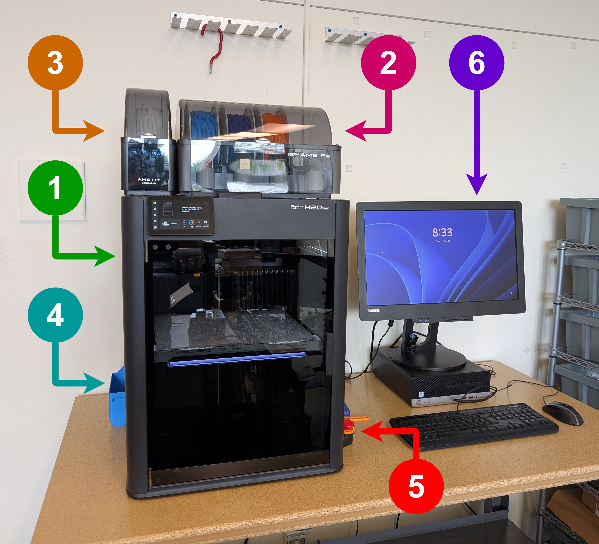

## Imprimante H2D Pro
L'imprimante H2D Pro se distingue des imprimantes du Fablab de génie mécanique sur deux caractéristiques.

1) Tête d'impression à deux buses
2) Volume d'impression plus large (325mm * 320mm * 325mm)

La tête d'impression à deux buses permet d'imprimer plusieurs matériaux et couleurs de manière plus efficace et rapide. Dans la majorité des cas, la buse secondaire sera utilisée pour l'utilisation de matériaux de support. Cependant, d'autres possibilités incluent l'impression de pièces composées de plusieurs types de plastique (TPU+PLA par exemple) ou l'impression de surfaces à plusieurs couleurs.

L'utilisation des deux buses a toutefois un impact sur la surface d'impression. En effet, comme le montre l'image ci-dessous, certaines zones ne sont pas accessibles à l'une ou l'autre des buses, dû à leur positionnement sur la tête d'outils. La surface accessible change donc en fonction de l'utilisation des buses.

> [!TIP]
> Le volume d'impression minimal accessible aux 2 buses est 300mm * 320mm * 320mm

    

## AMS 2 Pro

L'AMS (Automatic Material System) est un outil de gestion des filaments d'impression. Le boîtier peut contenir jusqu'à 4 bobines de filaments et permet d'automatiquement alimenter l'une des buses avec l'une des quatre bobines à la fois.

> [!IMPORTANT]
> L'AMS 2 Pro est connecté à la **_buse de droite_** de l'imprimante.

En plus de pouvoir maintenir la qualité du plastique en contrôlant l'humidité et la température de l'enclos, l'AMS 2 Pro permet le changement automatique du filament utilisé par la buse droite lors de l'impression.

> [!NOTE]
> L'AMS 2 Pro permet à la buse droite d'imprimer un maximum de 4 filaments différents de manière automatique. Plus que cette quantité et le filament devra être changé manuellement durant l'impression. Il est aussi important de noter que chaque changement de filament demande une purge de la buse et donc des déchets supplémentaires.

### Remplacer un filament dans l'AMS 2 Pro
> [!IMPORTANT]
> 

 Lire les **_4 étapes suivantes au complet_** et ensuite regardez la vidéo suivante pour vous assurer d'avoir compris la séquence à accomplir avant d'intéragir avec l'AMS 2 Pro.

1) Pour ouvrir l'AMS, il est **_important de le débarrer en rabattant les bras de blocage vers l'intérieur_**. Par la suite, le couvercle peut être ouvert.
2) Pour retirer une bobine, poussez sur la plaque d'appui à la bouche d'entrée de filament pour libérer le filament de la serre de l'AMS. La plaque d'appui est en gris pâle et doit être poussée vers l'intérieur de l'AMS. En gardant la plaque d'appui enfoncée, tirez sur le filament pour le retirer de la bouche d'entrée. Finalement, retirez la bobine de l'AMS.
3) Pour installer une nouvelle bobine, commencez par placer la bobine dans l'espace voulu. Par la suite, poussez sur la plaque d'appui à la bouche d'entrée de filament pour ouvrir la serre de l'AMS. En gardant la plaque d'appui enfoncée, insérer l'embout du filament dans la bouche d'entrée de filament. Une fois le filament suffisamment enfoncé, l'AMS va automatiquement commencer à avaler le filament.
4) Pour refermer l'AMS, fermez le couvercle et barrez ce dernier en redressant les bras de blocage.

La vidéo ci-dessous montre la démarche complète pour changer une bobine.

    

## AMS HT
Tout comme l'AMS 2 Pro, l'AMS HT (High Temperature) permet la gestion de l'humidité et de la température du filament sur la bobine. Cependant, cet appareil ne permet de contenir qu'une seule bobine. En échange, il permet un séchage plus performant du filament qu'il contient. Cette fonctionnalité est surtout intéressante pour les matériaux plus difficiles à imprimer tels que le TPU et l'ABS.

> [!IMPORTANT]
> L'AMS HT est connecté à la **_buse de gauche_** de l'imprimante.

### Remplacer un filament dans l'AMS HT
> [!IMPORTANT]
> 

Lire les **_4 étapes suivantes au complet_** et ensuite regardez la vidéo suivante pour vous assurer d'avoir compris la séquence à accomplir avant d'intéragir avec l'AMS HT.

1) Pour ouvrir l'AMS, simplement tirer vers le haut la petite poignée pour décrocher l'avant du couvercle. Le couvercle peut ensuite être ouvert.
2) Pour retirer la bobine, pousser sur le bouton se situant à l'intérieur de l'enclos pour libérer la serre de l'AMS. Se référer à la photo ci-dessous pour situer le bouton. À noter que le bouton demande beaucoup de pression pour libérer son emprise sur le filament. Par la suite, tout en gardant le bouton enfoncé, retirer le filament de la bouche d'entrée de filament. Finalement, retirer la bobine de l'AMS.
3) Pour installer une nouvelle bobine, placez la bobine dans l'AMS. Ensuite, simplement insérer l'embout du filament dans la bouche d'entrée de filament. Le bouton **_n'a pas besoin_** d'être enfoncé. Une fois le filament suffisamment inséré, l'AMS va automatiquement commencer à avaler le filament.
4) Pour refermer l'AMS, simplement refermer le couvercle jusqu'à ce que le crochet avant s'enclenche.

    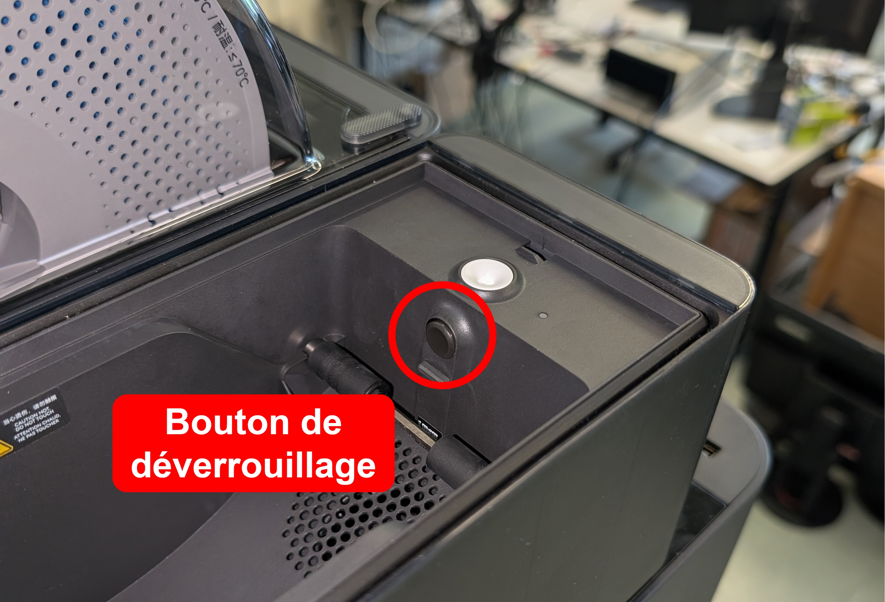

La vidéo ci-dessous montre la démarche complète pour changer la bobine.

    

## Chute et panier de déchet
La chute à déchets sert à récupérer les petits amas de plastiques produits par l'imprimante lors de calibration de la buse ou lors de la purge d'un type de plastique de la buse. Le panier doit être vidé occasionnellement pour éviter qu'il ne déborde.

## Bouton d'arrêt d'urgence
Le bouton d'arrêt d'urgence se trouve à droite de l'imprimante et permet l'arrêt de la machine.

> [!CAUTION]
> Le bouton d'urgence coupe directement l'alimentation de la machine. Il est donc fortement déconseillé d'arrêter une impression de cette manière, car cette dernière sera perdue.

## Poste GMC-ROBOT-BAMBU
Tout comme les imprimantes du Fablab, l'imprimante H2D Pro est uniquement accessible au travers du poste informatique associé. Tout étudiant du laboratoire de robotique peut se connecter au poste. Il est possible de le faire physiquement ou par connexion à distance comme tout autre poste du laboratoire. La connexion à distance sur le poste permet de lancer des impressions à distance.

> [!IMPORTANT]
> Le nom du poste est : **_GMC-ROBOT-BAMBU_**

> [!CAUTION]
> Avant de lancer une impression, s'assurer qu'un plateau d'impression est bien installé et qu'aucune pièce n'est présente sur le plateau.

Pour vérifier l'état du plateau, il faut soit se déplacer physiquement pour inspecter l'imprimante, ou soit utiliser la caméra interne de l'imprimante accessible dans l'onglet **_Device_** de **_Bambu Studio_**. Il faut se connecter à l'imprimante avant d'activer la caméra. Si vous vous connectez à distance, veuillez lire cette [section sur la connexion à l'imprimante](#ouverture-et-configuration-de-lenvironnement) avant de continuer. Si le plateau d'impression n'est pas présent, se référer à la [section d'installation du plateau](#réinstaller-le-plateau-dimpression-dans-limprimante).

    

# Procédure d'impression
La procédure pour lancer une impression est la même lorsque physiquement au poste ou en connexion à distance. Cependant, certaines opérations requièrent des opérations manuelles sur la machine.

## Ouverture et configuration de l'environnement
La première étape est de se connecter au poste **_GMC-ROBOT-BAMBU_**. Pour avoir accès à vos fichiers d'impression sur ce poste, vous pouvez les placer sur une clé USB (si sur poste physique) ou aller les chercher directement sur votre espace réseau ROBOT. Il est aussi possible de copier des fichiers d'un poste à l'autre en connexion à distance.

> [!IMPORTANT]
> Lors de l'ouverture d'une session sur GMC-ROBOT-BAMBU, il est important de **_NE PAS_** lancer Bambu Studio immédiatement. Plutôt, attendre que la **_console CMD_** termine de rouler son script et qu’elle se ferme par elle-même. Le script sert à copier des fichiers de configuration, notamment nécessaires pour se connecter à l'imprimante. Si le logiciel a été ouvert trop tôt, celui-ci va indiquer que le fichier de configuration est corrompu. Dans un tel cas, simplement fermer et réouvrir le logiciel une fois la console CMD fermée. 
 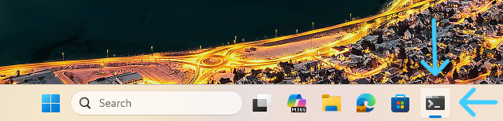 

Une fois la console CMD fermée, ouvrir **_Bambu Studio_**. La première étape est de se connecter à l'imprimante pour pouvoir synchroniser Bambu Studio avec notre configuration d'AMS. Dirigez-vous vers l'onglet **_Device_** et cliquez en haut à gauche sur **_No printer_**. Une liste devrait apparaitre et sous **_My Device_**, cliquez sur l'imprimante **_H2D-PRO-ROBOT(LAN)_**. Après une seconde ou deux, la connexion devrait s'établir. Lorsque la connexion est effectuée, retournez dans l'onglet **_Prepare_** et cliquez sur le bouton **_Sync info_**. Une fois la synchronisation des buses et de l'AMS effectuée, le logiciel va demander de continuer vers la synchronisation des filaments. Si les filaments du projet ne sont pas les mêmes que sur les AMS, le logiciel va vous demander d'associer les filaments réels dans les AMS à ceux du projet.

    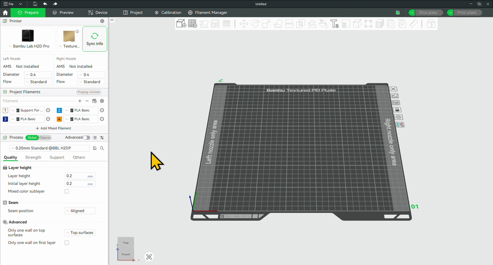

## Changer les filaments
Si les filaments nécessaires à votre impression ne sont pas déjà dans les AMS, alors il faudra les changer. La démarche pour le changement du filament pour chaque AMS se trouve aux sections respectives [AMS 2 Pro](#remplacer-un-filament-dans-lams-2-pro) et [AMS HT](#remplacer-un-filament-dans-lams-ht).

Vous pouvez placer les filaments dans les emplacements qui vous semblent bons. Cependant, lorsque vous allez cliquer sur **_Slice part_** et que vous sélectionnez **_Filament-saving mode_**, le logiciel va vous indiquer comment positionner les filaments dans les AMS pour diminuer les pertes (et accélérer l'impression !). Si on prend l'exemple de la carte de tolérancement ci-dessous, il m'est indiqué de positionner le filament orange dans l'AMS HT (buse de gauche) et le bleu et cyan dans l'AMS 2 Pro (buse de droite). Ce choix est fait, car une fois la base de la pièce terminée (en bleu), la buse de droite peut passer au cyan pour terminer le texte sur le dessus de la pièce qui est en orange et cyan.

    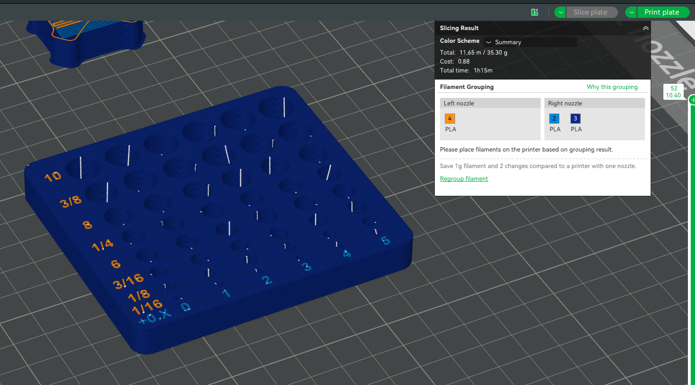

> [!WARNING]
> Les bobines Bambu que nous utilisons contiennent une puce RFID pouvant être lue par l'AMS. Cette puce contient l'information quant à l'identité du filament et permet donc à l'AMS et l'imprimante de détecter automatiquement la sorte de filament ainsi que sa couleur. Cependant, cette puce n'est parfois pas capable d'être lue par l'AMS. Dans un tel cas, simplement utiliser l'écran de l'imprimante et dirigez-vous vers le menu des filaments (icône de bobine). Dans ce menu, cliquez sur le filament non reconnu et cliquez sur **_Edit_** pour entrer manuellement les informations du filament. Cette démarche est aussi à faire si le filament n'est pas de la marque Bambu.
 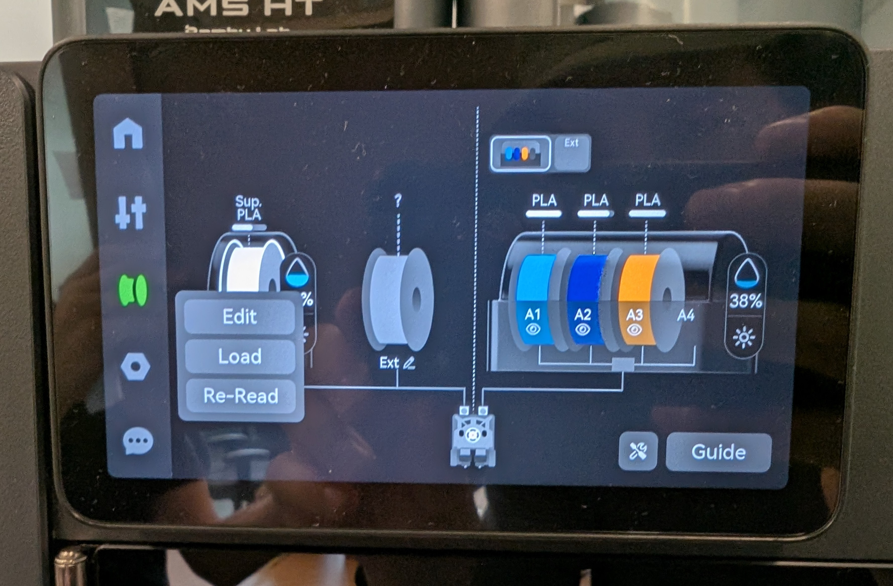 

> [!IMPORTANT]
> Une fois les filaments repositionnés ou changés dans les AMS, il est important de resynchroniser les informations de l'imprimante avec le logiciel.

## Préparer le plateau d'impression
Avant de commencer, prenons le temps de se familiariser avec l'environnement de préparation du plateau. Celui-ci se trouve à l'onglet **_Prepare_**. Nous avons trois sections sur la gauche, soit.

1) Printer
2) Project Filaments
3) Process

La section **_Printer_** devrait être complétée après s'être connecté à l'imprimante et avoir synchronisé les informations de l'imprimante.

La section **_Project Filaments_** sert à indiquer les filaments qui seront utilisés pour l'impression.

> [!NOTE]
> Après la synchronisation des informations de l'imprimante, le logiciel va automatiquement créer un filament pour chaque filament réel détecté dans les AMS.

    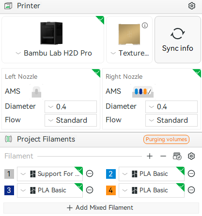

Dans l'exemple ci-dessus, on voit que j'ai le matériau de support de l'AMS HT ainsi que les trois couleurs de PLA de mon AMS 2 Pro, pour un total de 4 filaments.

Avant de continuer à la section **_Process_**, placez vos pièces sur le plateau. La barre d'outils se trouvant au dessus du rendu du plateau permet notamment d'ajouter des modèles et de repositionner les pièces. D'autres options incluent la modification légère des modèles ainsi que l'ajout manuel de supports et la coloration manuelle.

    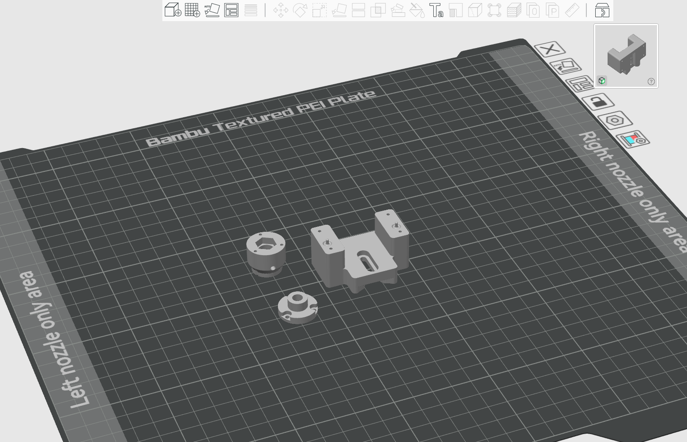

> [!NOTE]
> Si vous importez un fichier STEP, le logiciel va vous demander de sélectionner la déflexion linéaire et angulaire voulue. En effet, le logiciel doit convertir le fichier en STL sous forme de triangles. Plus la déflexion est faible, plus le modèle résultant sera de haute résolution et plus il sera précis. Cependant, le temps pour la découpe sera plus élevé. 

    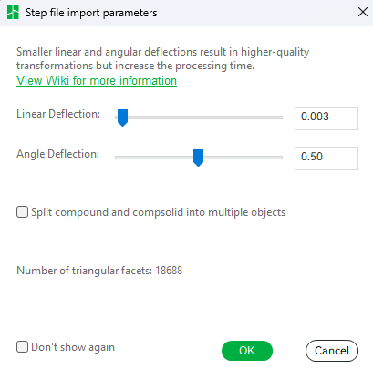

Dans process, on peut remarquer qu'il y a une glissière pouvant alterner entre **_Global_** et **_Objects_**. Dans Global, il est possible de modifier les paramètres globaux de l'impression. C'est généralement dans cette section que la majorité des utilisateurs vont modifier leurs paramètres. Juste sous la bannière, on peut voir un menu déroulant. Celui-ci contient des profils de paramètres préenregistrés. À noter que les profils peuvent être ajustés au besoin. Pour ce faire, visiter les sous-menus pour modifier les paramètres voulus. Dans l'image présentée ci-dessous, on a **_Quality_**, **_Strength_**, **_Support_** et **_Others_**.

    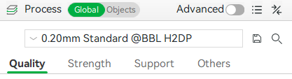

> [!NOTE]
> Certains paramètres sont cachés par défaut. Pour avoir accès à tous les paramètres, cliquez sur la glissière **_Advanced_** pour afficher les paramètres avancés.

Si on passe aux paramètres des objets, on peut voir notre plateau ainsi que nos modèles. Comme on peut le voir sur l'image ci-dessous, le logiciel a choisi le filament 1 pour imprimer mes 3 pièces, ce qui n'est pas idéal considérant que celui-ci est mon matériel de support. Pour changer le filament d'impression des pièces, soit cliquer droit sur la pièce et aller dans **_Change Filament_**, ou soit cliquer directement sur le numéro du filament à côté du modèle. À noter que cette dernière option prend quelques clics.

    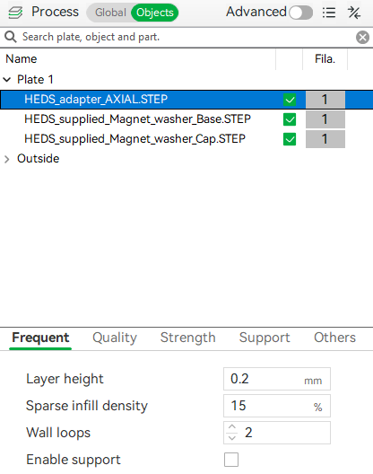

Lorsqu'une pièce est sélectionnée, on peut voir que les sous-menus de paramètres d'impression sont affichés plus bas. Ceci permet de modifier les paramètres d'impression pour les différents modèles. Par exemple, je pourrais augmenter le pourcentage de remplissage à 30% pour une pièce tout en gardant les autres à 15%.

Il est aussi possible de sélectionner le plateau dans la liste pour accéder à des paramètres d'impression comme le type de plateau et la séquence d'impression.

    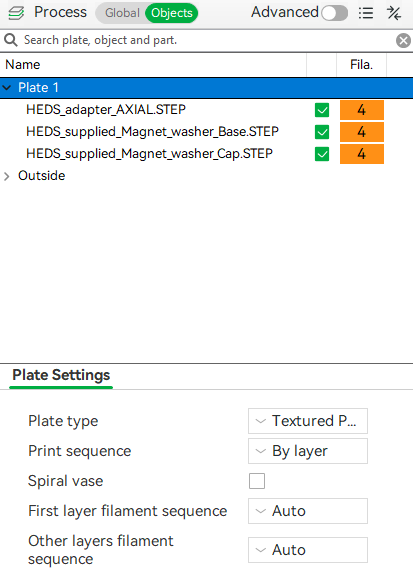

Une fois les pièces agencées et les paramètres d'impression choisis, cliquez sur **_Slice part_**. Le logiciel va ensuite convertir votre plateau en fichier d'impression et vous emmener à l'onglet **_Preview_**. Il est ensuite possible d'inspecter le rendu réel de la tâche d'impression. La glissière le long du côté droit permet d'inspecter chaque couche d'impression.

    

> [!NOTE]
> À chaque fois qu'un paramètre d'impression est modifié, le plateau doit être retranché (sliced) avant de permettre l'impression.

## Utiliser le matériau de support
Contrairement à d'autres imprimantes, le matériel de support ne sert pas à construire l'entièreté de la structure de support. En effet, il est plus efficace de construire la majorité de la structure de support dans le même matériel que la pièce supportée. Le matériel de support est utilisé uniquement pour faire l'interface entre le support et la pièce supportée. Cette couche d'interface permet d'aisément séparer le support de la pièce tout en améliorant la finit de surface de la pièce à l'interface.

    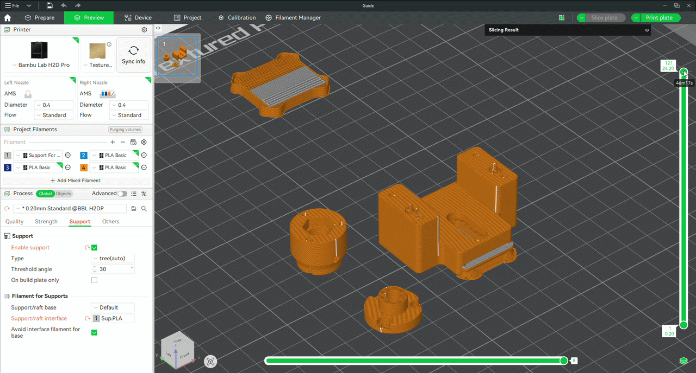

Pour utiliser le matériau de support, dirigez-vous dans la sous-section **_Support_** et activez le support. Ensuite, sous **_Filament for Supports_**, dans le paramètre **_Support/raft interface_**, sélectionnez le filament de support servant à créer l'interface. Ensuite, acceptez les suggestions de paramètres à activer.

 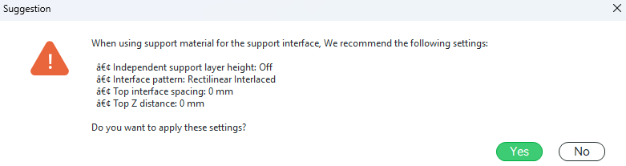 

> [!NOTE]
> Dès que les deux buses sont utilisées lors d'une impression, le logiciel va vous demander d'activer la tour de préparation (prime tower). Cette pièce sacrificielle sert à calibrer l'éjection du plastique lorsque l'imprimante passe d'une buse à l'autre. Cette tour est visible en haut à gauche du plateau d'impression dans la vidéo ci-dessus.
 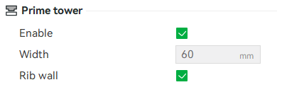 

## Lancer l'impression du plateau
Une fois la préparation du plateau terminée, la tâche d'impression peut être envoyée à l'imprimante en cliquant sur **_Print plate_**. Une page comme celle affichée ci-dessous devrait s'ouvrir. Celle-ci présente un sommaire de la configuration de l'imprimante ainsi que des choix pour la calibration préimpression. Il est suggéré de garder les calibrations en mode automatique. Finalement, cliquez sur **_Send_**.

    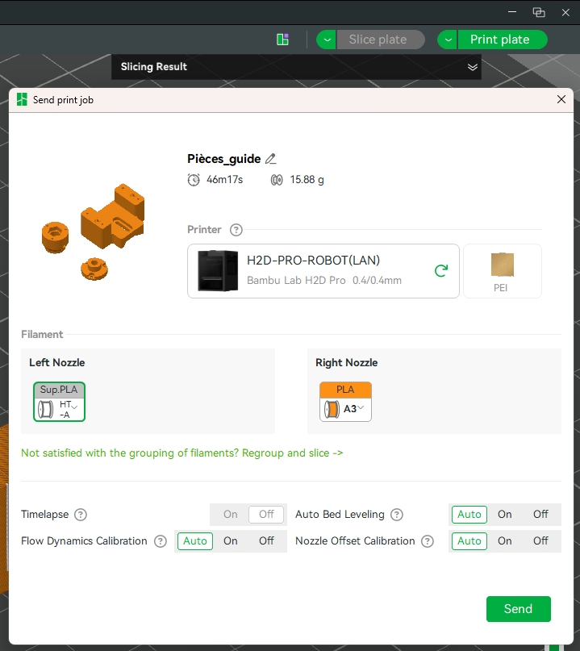

## Récupérer l'impression une fois terminée
> [!CAUTION]
> Une fois l'impression terminée, celle-ci peut être récupérée immédiatement. Cependant, le plateau sera encore très chaud. Si le plateau est au-dessus de 35°C, vous êtes dans **_l'obligation de mettre des gants pour retirer le plateau d'impression_** de l'imprimante. La température du plateau est affichée dans le menu des paramètres de l'imprimante sur l'écran de l'imprimante. 
 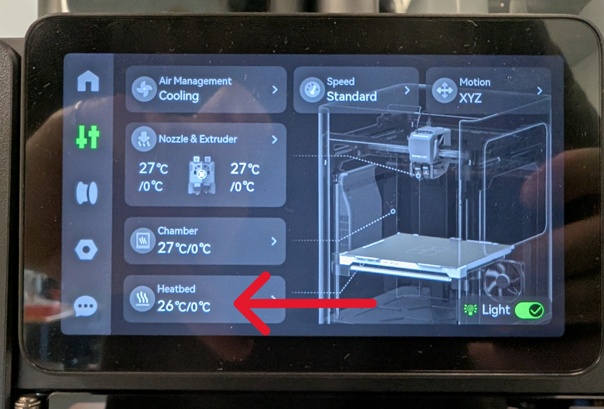 

Pour retirer le plateau d'impression, simplement pincer les brides à l'extrémité du plateau, du côté de la porte, et tirer l'embout du plateau vers le haut. Celui-ci devrait se décoller des aimants sur la surface de l'imprimante. Par la suite, glisser le plateau hors de l'imprimante.

    

Pour retirer les pièces du plateau, ce dernier peut être légèrement plié. De plus, un grattoir en plastique est aussi disponible.

    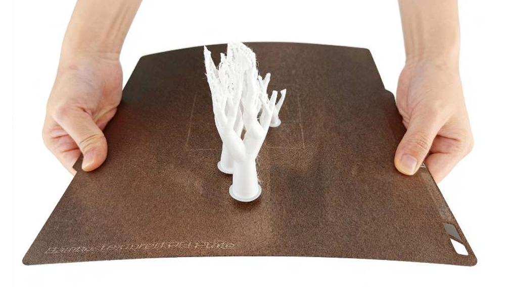

> [!CAUTION]
> Si des supports doivent être retirés des pièces, vous devez mettre des lunettes de sécurité pour vous protéger des éclats.

### Réinstaller le plateau d'impression dans l'imprimante
Pour faciliter l'utilisation de l'imprimante pour tous, veuillez réinstaller le plateau d'impression dans l'imprimante une fois les pièces récupérées. Veuillez vous assurer qu'aucun plastique n'est encore collé sur le plateau.

Le plateau ainsi que la surface de réception de l'imprimante comportent des brides permettant de centrer le plateau dans l'imprimante. Pour replacer le plateau, gardez celui-ci en angle avec son embout arrière touchant à la surface de l'imprimante. Ensuite, glissez le plateau vers l'arrière jusqu'à ce que les brides du plateau se soient imbriquées avec le système de localisation de la surface de l'imprimante. Finalement, abaisser le plateau jusqu'à ce qu'il se colle à l'aide des aimants sur la surface de l'imprimante.

    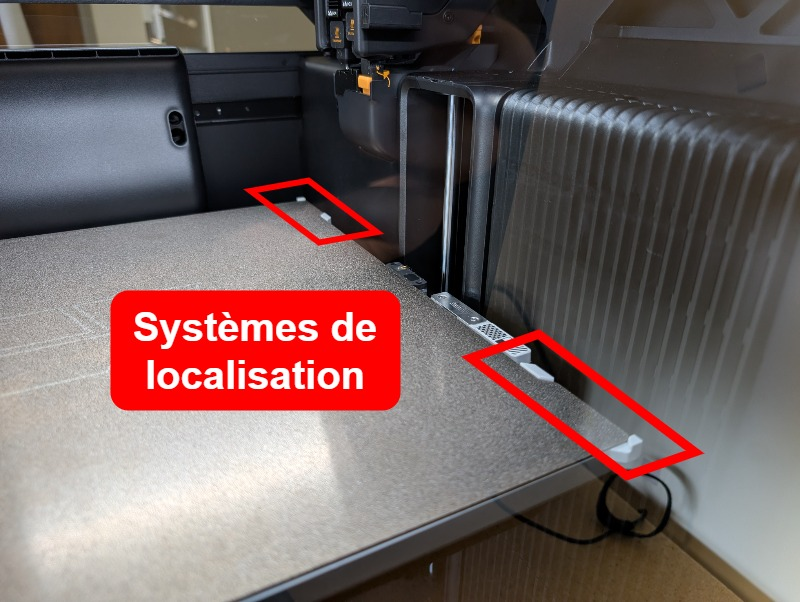

    

# Gabarit de tolérances
Comme pour toute imprimante 3D, la précision de la machine n'est pas parfaite. Notamment, les trous sont généralement plus petits qu'originalement modélisés. Il faut donc souvent ajouter une compensation pour obtenir la dimension voulue. De manière à simplifier le design pour impression sur la H2D Pro, un gabarit de tolérances d'alésages a été imprimé pour permettre de tester le résultat de plusieurs compensations à plusieurs tailles utilisées couramment, soit 1/16in, 1/8in, 3/16in, 6mm, 1/4in, 8mm, 3/8in et 10mm. Les incréments de compensation sont par bonds de 0.1mm. 

    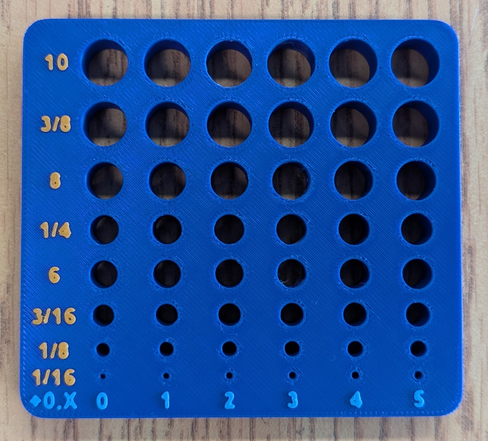

# TODO
- [ ] Ajout de la procédure pour l'impression avec TPU
- [ ] Ajout de la procédure pour impression multi-matériaux / multi-couleur
- [ ] Ajout de la version anglaise du guide
- [ ] Impression d'un gabarit de tolérance pour les arbres