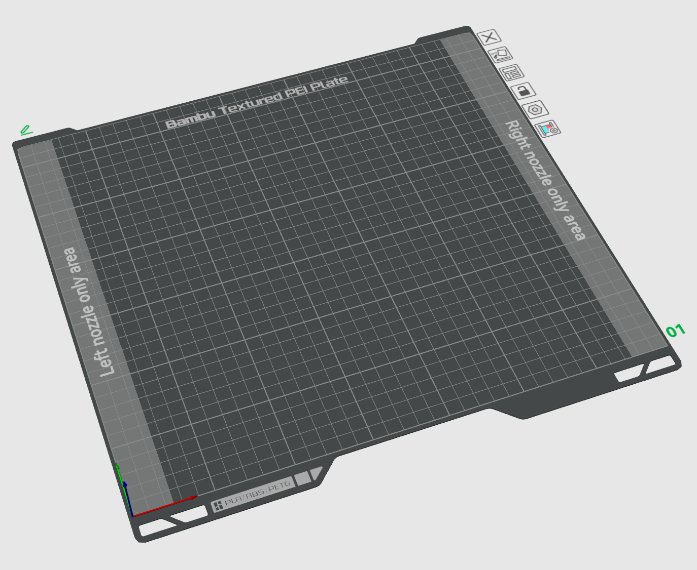
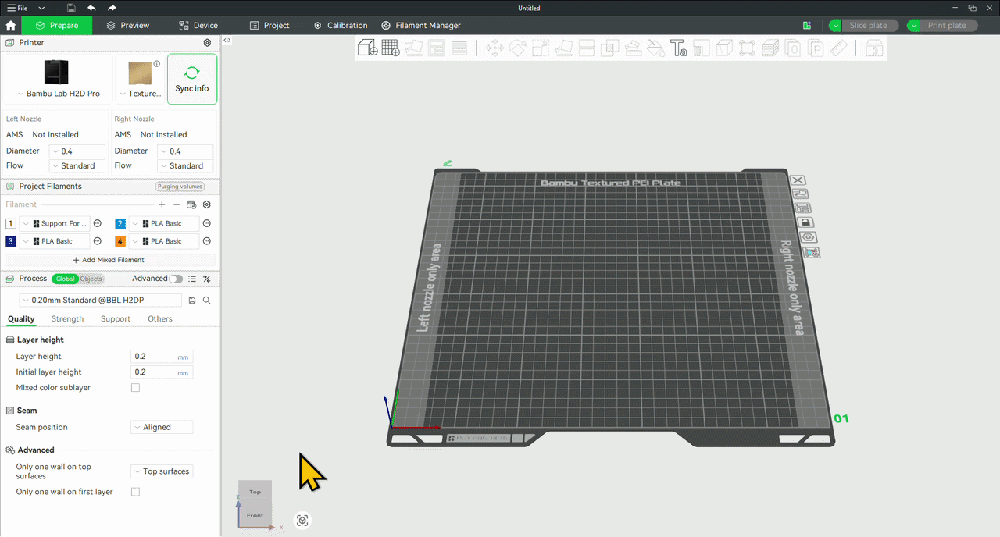

# Guide-Bambu-Robot
Guide d'utilisation de la Bambu H2D Pro du laboratoire de robotique.

# Table des matières

# Station d'impression
La station d'impression se trouve à l'entrée du local **_PLT-3702_** et contient les éléments suivants.

1) Imprimante **_Bambu-Labs H2D Pro_**
2) **_AMS 2 Pro_**
3) **_AMS HT_**
4) Chute et panier de déchets
5) Bouton d'arrêt d'urgence
6) Poste **_GMC-ROBOT-BAMBU_**

//TODO : Ajouter une image avec les différents éléments

## Imprimante H2D Pro
L'imprimante H2D Pro se distingue des imprimantes du Fablab sur deux caractéristiques.

1) Tête d'impression à deux buses
2) Volume d'impression plus large (325mm * 320mm * 325mm)

La tête d'impression à deux buses permet d'imprimer plusieurs matériaux et couleurs de manière plus efficace et rapide. Dans la majorité des cas, la buse secondaire sera utilisée pour l'utilisation de matériaux de support. Cependant, d'autres possibilité incluent l'impression de pièces composées de plusieurs types de plastique (TPU+PLA par exemple) ou l'impression de surfaces à plusieurs couleurs.

L'utilisation des deux buses à toutefois un impact sur la surface d'impression. En effet, comme le montre l'image ci-dessous, certaines zones ne sont pas accessibles à l'une ou l'autre des buses, dû à leur positionnement sur la tête d'outils. La surface accessible change donc en fonction de l'utilisation des buses.

> [!TIP]
> Le volume d'impression minimal accessible aux 2 buses est 300mm * 320mm * 320mm

    

## AMS 2 Pro

L'AMS (Automatic Material System) est un outils de gestion des filaments d'impression. Le boîtier peut contenir jusqu'à 4 bobines de filaments et permet d'automatiquement alimenter l'une des buses avec l'une des quatres bobines à la fois.

> [!IMPORTANT]
> L'AMS 2 Pro est connecté à la buse de droite de l'imprimante.

En plus de pouvoir maintenir la qualité du plastique en contrôlant l'humidité et la température de l'enclos, l'AMS 2 Pro permet de la changement automatique du filament utilisé par la buse droite lors de l'impression.

> [!NOTE]
> L'AMS 2 Pro permet à la buse droite d'imprimer un maximum de 4 filaments différents de manière automatique. Plus que cela et le filament devra être changé manuellement durant l'impression. Il est aussi important de noter que chaque changement de filament demande une purge de la buse et donc des déchets supplémentaires.

//TODO : Ajout d'un guide de remplacement des bobines

## AMS HT
Tout comme l'AMS 2 Pro, l'AMS HT (High Temperature) permet de la gestion de l'humidité et de la température du filament sur la bobine. Cepedant cet appareil ne permet de contenir qu'une seule bobine. En échange, il permet un séchage plus performant du filament qu'il contient. Cette fonctionnalité est surtout intéressante pour les matériaux plus difficiles à imprimer tels que le TPU et l'ABS.

> [!IMPORTANT]
> L'AMS HT est connecté à la buse de gauche de l'imprimante.

//TODO : Ajout d'un guide de remplacement de la bobine

## Chute et panier de déchet
La chute à déchets sert à récupérer les petits amats de plastiques produits par l'imprimante lors de calibration de la buse ou lors de la purge d'un type de plastique de la buse. Le panier doit être vidé occasionnellement pour éviter qu'il ne déborde.

## Bouton d'arrêt d'urgence
Le bouton d'arrêt d'urgence se trouve à droite de l'imprimante et permet l'arrêt de la machine.

> [!CAUTION]
> Le bouton d'urgence coupe directement l'alimentation de la machine. Il est donc fortement déconseillé d'arrêter une impression de cette manière, car ce dernier sera perdu.

## Poste GMC-ROBOT-BAMBU
Tout comme les imprimantes du Fablab, l'imprimante H2D Pro est uniquement accessible au travers du poste informatique associé. Tout étudiant du laboratoire de robotique peut se connecter au poste. Il est possible de la faire physiquement ou en connexion à distance comme tout autre poste du laboratoire. La connexion a distance sur le poste permet de lancer des impressions à distance.

> [!IMPORTANT]
> Le nom du poste est : **_GMC-ROBOT-BAMBU_**

> [!CAUTION]
> Avant de partir une impression s'assurer qu'un plateau d'impression est bien installé et qu'aucune pièce n'est présente sur le plateau.

Pour vérifié l'état du plateau, il faut soit se déplacer physiquement pour inspecter l'imprimante, ou soit utiliser la caméra interne de l'imprimante accessible dans l'onglet **_Device_** de **_Bambu Studio_**.

    

